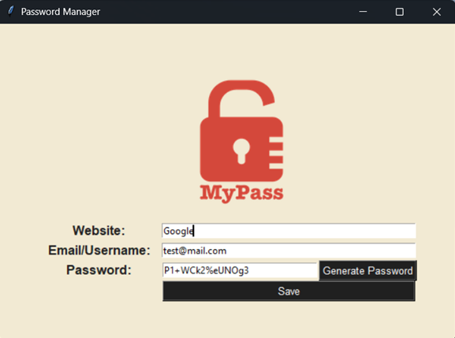

# Password Manager

A simple yet functional Password Manager GUI application built with Python and Tkinter.
It allows users to generate secure passwords, copy them to the clipboard, and save login credentials (website, username/email, and password) to a local file.

## 🧰 Features

`Password Generator`:
Randomly creates strong passwords with a mix of letters, numbers, and symbols.

`Clipboard Copy`:
Automatically copies the generated password to your clipboard for easy use.

`Data Saving`:
Saves your website, username, and password entries into a local text file (data.txt).

`Modern UI`:
Clean Tkinter-based interface with light background colors and dark accent elements.

## 🖼️Preview:

## 🧩 Libraries and Tools Used
`tkinter`: 
- Python’s standard GUI library
- Window creation (Tk())
- Widgets such as Label, Entry, Button, and Canvas
- Grid layout management
- Message dialogs (messagebox)

`random`:
- Standard Python module for generating random numbers and selections.
- Creates randomized combinations of letters, digits, and symbols to form secure passwords.

`pyperclip`:
- Cross-platform clipboard module.
- Automatically copies the generated password to the system clipboard, enabling quick paste into other apps.

`tkinter.messagebox`:
- Provides modal dialog boxes to show alerts or confirmations.

## 🖥️ How It Works

1) Enter a website name and your email/username.

2) Click "Generate Password" to create a secure random password.

3) The password will be auto-copied to your clipboard.

4) Click "Save" to store your credentials into data.txt in the format: `website | username | password`

All saved entries are appended to the text file, making it easy to retrieve or back up later.

## 📁 Project Structure
password_manager/  
│ 
├── images/ 
│   └── logo.png        &nbsp;&nbsp;&nbsp;# App logo used in the GUI 
│ 
├── data.txt            &nbsp;&nbsp;&nbsp;# Created automatically to store credentials 
│ 
└── main.py             &nbsp;&nbsp;&nbsp;# Main application script 

## 🧠 Customization

a) <b>Default email:</b>
Set your email in the constant `YOUR_EMAIL`.

b) <b>Appearance:</b>
You can easily change background or accent colors:

`BG_COLOR = "#F2EAD3"`
`ACCENT_COLOR = "#202020"`

c) <b>Password complexity:</b>
Adjust the randomization `parameters in get_random_char()` to increase or decrease password strength.

## 🚀 Getting Started
Requirements

- Python 3.8+

- Libraries: `pip install pyperclip`

Run the app
`python main.py`

📜 License

This project is open-source and available under the MIT License.